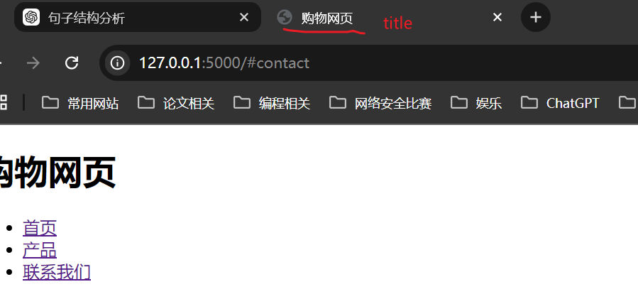
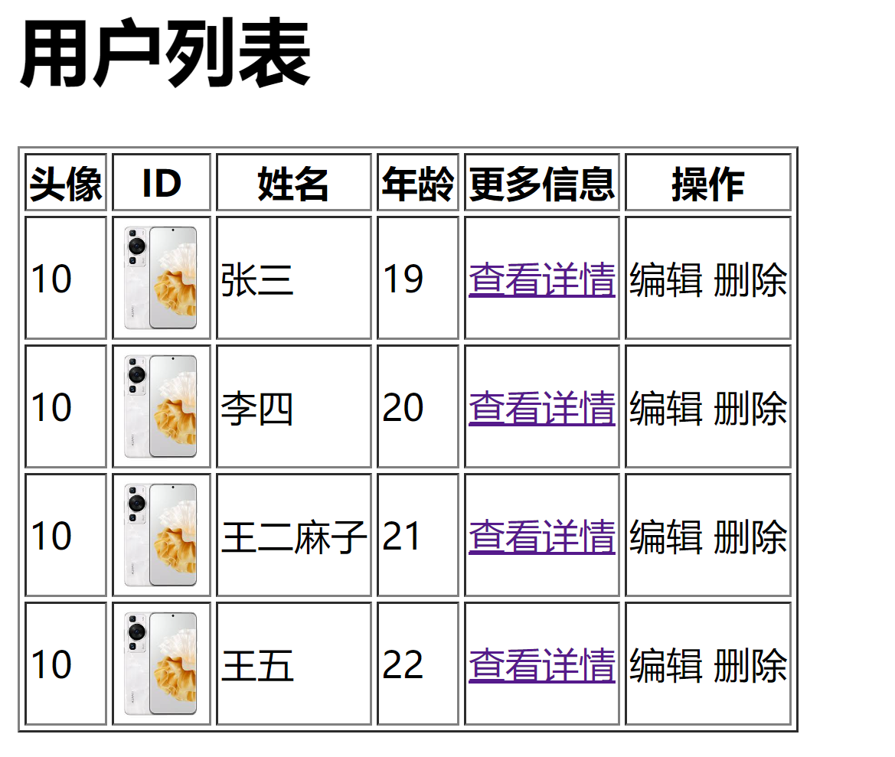

# 1.快速开发网站
```
pip install flask
```
```python
from flask import Flask

app = Flask(__name__)


# 创建了网址 /show/info和函数show_info之间的映射关系
# 用户在浏览器上访问/show/info时，会执行show_info函数，并返回字符串'This is a test page'
@app.route('/')
def show_info():
    return 'This is a test page'

if __name__ == '__main__':
    app.run()

```
网站过于丑陋
```
浏览器可以识别很多标签+数据，如：
    <h1>中国</h1>                           -> 浏览器看见会加大加粗
    <span style='color:red;'>联通</span>    -> 浏览器看见会将字体变红
如果能把浏览器能识别的所有标签都学会，就能在网站控制页面长什么样子。
```
[HTML教程](https://developer.mozilla.org/en-US/docs/Web/HTML)
- Flash框架支持将字符串写入到文件中，调用该文件。
```
from flask import Flask,render_template

app = Flask(__name__)


# 创建了网址 /show/info和函数show_info之间的映射关系
# 用户在浏览器上访问/show/info时，会执行show_info函数，并返回字符串'This is a test page'
@app.route('/')
def show_info():
    return render_template('index.html')

if __name__ == '__main__':
    app.run()

```

# 2.浏览器能识别的标签
## 2.1 编码(head)
```html
<meta charset="UTF-8">
```
## 2.2 title(head)
```html
<head>
    <meta charset="UTF-8">
    <meta name="viewport" content="width=device-width, initial-scale=1.0">
    <title>购物网页</title>
    <link rel="stylesheet" href="styles.css">
</head>
```



## 2.3 标题

```html
<!DOCTYPE html>
<html lang="zh-CN">
<head>
    <meta charset="UTF-8">
    <meta name="viewport" content="width=device-width, initial-scale=1.0">
    <title>标题示例</title>
</head>
<body>
    <h1>一级标题</h1>
    <h2>二级标题</h2>
    <h3>三级标题</h3>
    <h4>四级标题</h4>
    <h5>五级标题</h5>
</body>
</html>
```
## 2.4 div和span
```html
<div>内容</div>
<span>内容</span>
```
- div，一个人占据一整行，【块级标签】
    - 用途：通常用于将文档中的大块内容分组，如段落、图像、表格等。
```html
<div>
    <h1>标题</h1>
    <p>这是一个段落。</p>
</div>
```
- span, 自己有多大就占多少（内联标签，行内标签）
    - 用途：通常用于将文档中的小块内容分组，如单词、短语或者图标，常用于样式化小块的内容。
```html
<p>这是一个 <span style="color: red;">红色</span> 的单词。</p>
```
注意：这两个标签结合CSS可以定制自己的功能。

### 1.超链接
```html
跳转到其他人的网页
<a href="www.baidu.com">点击跳转</a>
```
```html
跳转到自己的网页
<a href="http://127.0.0.1:5000/get/news">点击跳转</a>
<a href="/get/news">点击跳转</a>
```
```html
# 当前页面打开
<a href="https://item.jd.com/100008348542.html">点击跳转</a>

# 新页面打开
<a href="https://item.jd.com/100008348542.html"  target="_blank">点击跳转</a>

```

### 2.图片

```html
<imag src="图片地址"/>
```
```html
显示别人的网址：
<imag src="其他网站的图片地址"/>
```

### 3.列表

```html
# 无序列表
<ul>
    <li>中国移动</li>
    <li>中国联通</li>
    <li>中国移动</li>
</ul>
```

```html
# 有序列表
<ol>
    <li>中国移动</li>
    <li>中国联通</li>
    <li>中国移动</li>
</ol>
```

### 4.表格标签

```html
<table>
    <thead>
        <tr> <th>ID</th> <th>姓名</th> <th>年龄</th> </tr>  # 表头
    </thead>
    <tbody>
        <tr> <td>10</td>	<td>张三</td>		<td>19</td>	</tr>
        <tr> <td>10</td>	<td>李四</td>		<td>20</td>	</tr>
        <tr> <td>10</td>	<td>王二麻子</td>	<td>21</td>	</tr>
        <tr> <td>10</td>	<td>王五</td>		<td>22</td>	</tr>
    </tbody>
</table>
```
### 5.input 系列
```html
    <!-- 输入框 -->
    <input type="text" name="content" value="请输入内容">
    <input type="password">

    <!-- 上传文件按钮 -->
    <input type="file">

    <!-- 单选择按钮，name的值要相同，这样才能让两者互斥 -->
    <input type="radio" name="n1"> 男
    <input type="radio" name="n1"> 女

    <!-- 多选按钮 -->
    <input type="checkbox" name="n2"> 足球
    <input type="checkbox" name="n2"> 篮球
    <input type="checkbox" name="n2"> 乒乓球

    <input type="button" value="提交">  <!-- 普通按钮-->
    <input type="submit" value="提交">  <!-- 提交表单-->
```

### 6.下拉框
```html
    <!-- 单选下拉框 -->
    <select name="city">
        <option value="bj">北京</option>
        <option value="sh">上海</option>
        <option value="gz">广州</option>
    </select>
    <!-- 多选下拉框 -->
    <select name="city" multiple>
        <option value="bj">北京</option>
        <option value="sh">上海</option>
        <option value="gz">广州</option>
    </select>
```
### 7.多行文本
```html
    <!-- 文本域宽度为30，高度为10，可以输入多行文本 -->
    <textarea name="content" cols="30" rows="10">请输入内容</textarea>
```


# 总结

- 学习的标签
```htlm
  <h1></h1>
  <div></div>
  <span></span>
  <a></a>
  
```

- 划分

```html
- 块级标签
    <h1></h1>
    <div></div>
- 行内标签
    <span></span>
    <a></a>
    <imag />
```

- 嵌套

```html
    <div>
        <span>xxx</span>
        
        <a>超链接</a>

```
- 案例：商品列表
```html
<!DOCTYPE  html>
<html lang="en">
<head>
    <meta charset="UTF-8">
    <title>Title</title>
</head>

<body>
    <h1>商品列表</h1>
    <div>
        <span style="color: blue;">
            <p>商品列表</p>
            <ul>

                <li>
                    <a href="https://item.jd.com/100008348542.html" target="_blank">
                        
                        华为手机
                    </a>
                </li>
                <li>
                    <a href="https://item.jd.com/100008348543.html" target="_blank">
                        
                        小米手机
                    </a>
                </li>
                <li>
                    <a href="https://item.jd.com/100008348544.html" target="_blank">
                        
                        苹果手机
                    </a>
                </li>
            </ul>
        </span>
    </div>
</body>
</html>
```

- 案例：用户列表
```html
<!DOCTYPE>
<html lang="en">
<head>
    <meta charset="UTF-8">
    <title>用户列表</title>
</head>
<body>
    <h1>用户列表</h1>
    <table border="1">
        <thead>
            <tr> <th>头像</th> <th>ID</th> <th>姓名</th> <th>年龄</th> <th>更多信息</th> <th>操作</th> </tr>
        </thead>
        <tbody>
            <tr> 
                <td>10</td> 
                <td></td> 
                <td>张三</td> 
                <td>19</td>	
                <td><a href="https://www.youtube.com/" target="_blank">查看详情</a></td>
                <td>编辑 删除</td>
            </tr>
            <tr> 
                <td>10</td> 
                <td></td> 
                <td>李四</td> 
                <td>20</td>	
                <td><a href="https://www.youtube.com/" target="_blank">查看详情</a></td>
                <td>编辑 删除</td>	
            </tr>
            <tr> 
                <td>10</td> 
                <td></td> 
                <td>王二麻子</td> 
                <td>21</td>	
                <td><a href="https://www.youtube.com/" target="_blank">查看详情</a></td>
                <td>编辑 删除</td>
            </tr>
            <tr> 
                <td>10</td> 
                <td></td> 
                <td>王五</td> 
                <td>22</td>	
                <td><a href="https://www.youtube.com/" target="_blank">查看详情</a></td>
                <td>编辑 删除</td>
            </tr>
        </tbody>
    </table>
</body>
</html>
```



